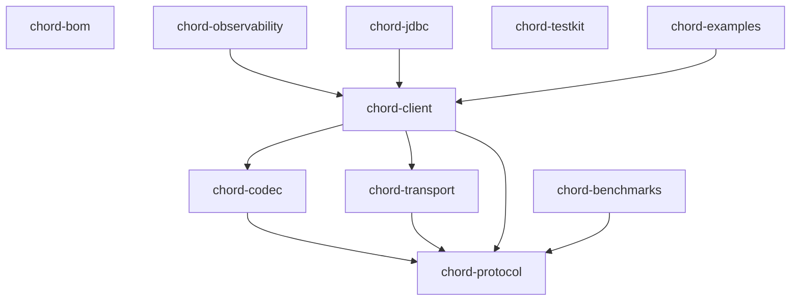

# Architecture

CHord is a Java client for ClickHouse whose primary transport is the ClickHouse native TCP wire
protocol. This document describes how the codebase is organised and the rules that keep it
correct. The protocol status itself lives in [protocol-compatibility.md](protocol-compatibility.md).

## Module graph



Rules:

- `chord-protocol` sits at the bottom with **zero runtime dependencies**. It owns packet
  identifiers, the revision and feature registry, handshake structures, wire primitives, the
  connection state machine and the exception hierarchy. It must never depend on pooling, JDBC,
  object mapping or frameworks.
- `chord-transport` provides byte transports behind the `NativeTransport` SPI: plain TCP and
  TLS, which layers JSSE over the same dial and deadlines with hostname verification that cannot
  be disabled (ADR-0012). It knows nothing about packets. `isSecure()` is part of the SPI
  because credential policy keys off it.
- `chord-codec` will own native block encoding, the recursive type model, the type name parser
  and compression framing from Phase 2.
- `chord-client` composes the three into the public client: today the low level
  `NativeConnection`; later query execution, inserts, pooling, failover and cancellation.
- `chord-testkit` deliberately depends on **no other CHord module**, so client tests can consume
  it without dependency cycles.
- `chord-jdbc` and `chord-observability` are placeholders that will only ever delegate to the
  native client.
- The base exception family lives in the root package `io.github.orhaugh.chord` (shipped inside
  `chord-protocol`) so every module shares one hierarchy.

## I/O and concurrency model

A ClickHouse native connection is stateful and executes one protocol exchange at a time. CHord
models that fact instead of hiding it:

- Blocking I/O over `java.net.Socket`. Blocking socket calls park cleanly on virtual threads, and
  `SO_TIMEOUT` provides read deadlines, which blocking `SocketChannel` cannot. There is no custom
  event loop; scalable concurrency comes from many connections on virtual threads
  (see ADR-0002).
- `WireReader` and `WireWriter` add buffering and the primitive codecs on top of the raw
  transport streams.
- A connection is single threaded by contract. The only cross thread operation is `close()`,
  which is also the hard abort mechanism: closing the socket unblocks a pending read.

## Connection state machine

Every connection is guarded by an explicit state machine; invalid transitions fail immediately
rather than desynchronising the stream.

```text
NEW -> HANDSHAKING -> READY -> PINGING ----------> READY
                        |                            |
                        +--> WRITING_QUERY -> READING_RESPONSE -> READY
                                     |                |   ^
                                     |                v   |
                                     |          WRITING_INSERT
                                     +--> CANCELLING
Any active state -> BROKEN -> CLOSED
Any state ------------------> CLOSED
```

`BROKEN` is terminal apart from closing: it means the protocol position of the peer is no longer
knowable (unknown packet, bounds violation, truncated stream, timeout mid exchange). Broken
connections are never reused; a future pool discards them (ADR-0006).

## Trust model for server data

Every length received from the wire is hostile until proven otherwise:

- `WireLimits` bounds strings, exception nesting and the Hello settings block before any
  allocation happens.
- Handshake strings and password rule counts mirror the server's own caps (4096 bytes, 256
  rules).
- VarUInt decoding rejects encodings a compliant writer cannot produce.
- Unknown packet types and unknown capability tokens raise `ChordProtocolException` and poison
  the connection.

Compression framing (Phase 4) extends the same posture with checksum validation, frame size caps
and decompression bomb protection.

## Revision negotiation

The client advertises `ProtocolRevisions.CURRENT`; the server reports its own revision; both
operate at the minimum. Every conditionally present field is gated through the `ProtocolFeature`
registry against that negotiated revision. Nothing in the codebase may compare revision integers
directly (ADR-0004).

## Exceptions

One unchecked hierarchy rooted at `ChordException`:

```text
ChordException
+-- ChordServerException          server executed and reported an error (code, name, stack trace)
+-- ChordAuthenticationException  credential rejection (server codes 192, 193, 194, 516)
+-- ChordProtocolException        wire violation; the connection is poisoned
+-- ChordTransportException       network failure
+-- ChordTimeoutException         a deadline elapsed
+-- ChordConfigurationException   invalid client configuration, raised before any I/O
+-- IllegalStateTransitionException  connection misuse (in the state package)
```

Later phases add pool, cancellation, type and data corruption subtypes when the features that
throw them exist. Secrets never appear in exception messages.

## Logging and diagnostics

Runtime modules use the SLF4J API only. Connections carry a numeric id used in every log line for
correlation. Connection establishment and close log at DEBUG, pings at TRACE. Packet payloads are
never logged; packet kinds and lengths may appear at TRACE. SQL logging (Phase 2) will be off by
default with configurable redaction.

## Testing strategy

- Byte level golden tests with hand written expected bytes for every encoding.
- Property based round trips (jqwik) across full value domains.
- Scripted transport tests driving the full handshake and ping against in memory byte scripts,
  asserting the exact bytes the client emits.
- Integration tests against real ClickHouse containers for every supported release (25.8, 26.3,
  26.6), covering success, authentication failure and unknown database paths.
- A nightly compatibility workflow sweeps the release matrix plus the newest server builds.
- Fault injection, fuzzing and soak suites join in later phases as the surface grows.

## Roadmap alignment

Implementation follows the phase plan tracked in [unsupported-features.md](unsupported-features.md):
transport and handshake (done), TLS, SELECT streaming, INSERT, compression and advanced packets,
pooling and resilience, advanced serialisations, JDBC, then release hardening. Architectural
decisions are recorded in [adr/](adr/).
